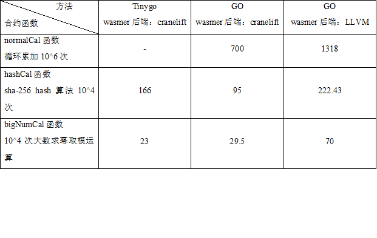

### MacOS 下编译成 libwasmer.dylib 库

```sh
$ make build-capi-cranelift
$ cp target/release/libwasmer.dylib vm-wasmer的目录/wasmer-go/packaged/对应架构/libwasmer.dylib
```

### Linux 下编译成 libwasmer.so 库

```sh
$ make build-capi-cranelift
$ cp target/release/libwasmer.so vm-wasmer的目录/wasmer-go/packaged/对应架构/libwasmer.so
```

### wasmer使用LLVM后端 【可选】

wasmer 内置了singlepass、Cranelift、LLVM三种后端编译器，其中，Singlepass 后端编译最快而运行最慢，LLVM 后端编译最慢而运行最快，Cranelift 编译运行速度均处中间水平。 长安链wasmer默认使用cranelift后端。

考虑到长安链使用场景，合约部署时vm_pool只用编译一次，故可以采用LLVM后端获得最快的运行速度，而不用担心编译开销：



### 安装LLVM 18

#### **官方安装**

国内一般安装比较慢，推荐使用镜像

```shell
wget https://apt.llvm.org/llvm.sh
chmod +x llvm.sh
sudo ./llvm.sh 18 all
```

#### 使用清华源镜像安装

国内推荐使用经基于清华源镜像安装LLVM 18，参考[llvm-apt | 镜像站使用帮助 | 清华大学开源软件镜像站 | Tsinghua Open Source Mirror](https://mirrors.tuna.tsinghua.edu.cn/help/llvm-apt/)

##### **脚本自动安装：**

```shell
wget https://mirrors.tuna.tsinghua.edu.cn/llvm-apt/llvm.sh
chmod +x llvm.sh
./llvm.sh 18 all -m https://mirrors.tuna.tsinghua.edu.cn/llvm-apt
```

##### **如果脚本安装失败，或无法使用镜像，可采用手动安装**

以Ubuntu 24.04 LTS为例

```
wget -O - https://apt.llvm.org/llvm-snapshot.gpg.key | gpg -o /etc/apt/keyrings/llvm-snapshot.gpg --dearmor
```

添加镜像，vim /etc/apt/sources.list.d/llvm-apt.list 添加：

```
deb [signed-by=/etc/apt/keyrings/llvm-snapshot.gpg] https://mirrors.tuna.tsinghua.edu.cn/llvm-apt/noble/ llvm-toolchain-noble-18 main
```

安装LLVM 18

```
sudo apt install -y \
    clang-18 lldb-18 lld-18 clangd-18 \
    clang-tidy-18 clang-format-18 clang-tools-18 \
    llvm-18-dev llvm-18-tools libomp-18-dev \
    libc++-18-dev libc++abi-18-dev \
    libclang-common-18-dev libclang-18-dev libclang-cpp18-dev \
    liblldb-18-dev libunwind-18-dev \
    libclang-rt-18-dev libpolly-18-dev
```

### 编译采用LLVM的wasmer

```
make build-capi-llvm
cp target/release/libwasmer.so vm-wasmer的目录/wasmer-go/packaged/对应架构/libwasmer.so
或
cp target/release/libwasmer.dylib vm-wasmer的目录/wasmer-go/packaged/对应架构/libwasmer.dylib
```

如果在编译过程中报缺少zlib、zst等库的错误，安装即可。

在项目的libwasmer文件夹中，我上传了的linux-amd64架构编译好的wasmer的.so文件。（后面可能还会对wasmer源码进行修改，故.so文件后面也会上传新的）

